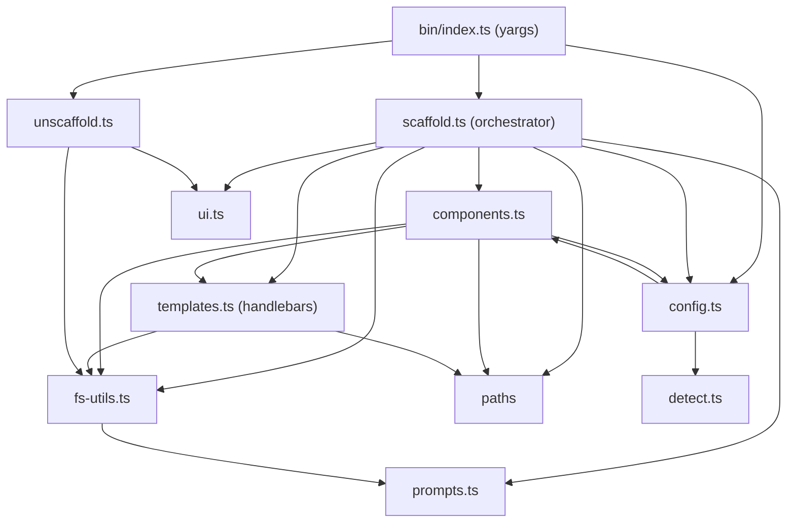

# Architecture

A CLI tool that bootstraps AI-agent-friendly documentation, configuration,
skills, and lifecycle hooks into any software project.

## Codebase layout

```
bin/index.ts           CLI entry point (yargs)
src/
  components.ts        Declarative component registry (category, dest, conflict, ownership)
  config.ts            Config types, defaults, config resolution
  detect.ts            Project detection engine (language, CI, AI tools, …)
  fs-utils.ts          File I/O, symlinks, directory walking
  prompts.ts           Interactive prompts (node:readline)
  scaffold.ts          Main orchestrator
  templates.ts         Handlebars template rendering
  ui.ts                Terminal UI (spinner, progress bar, colors)
  unscaffold.ts        Scaffold removal
templates/             Handlebars templates (.hbs) for what gets scaffolded
  root/                AGENTS.md, CLAUDE.md, BUSINESS_LOGIC.md, .gitignore
  docs/                ADR templates, agent docs, CODING_PRINCIPLES, context
  skills/              24 agent skills (bugfix, tdd, implement, superpowers, handoff, …)
  hooks/               4 lifecycle hooks (pre/post feature/bugfix/session)
  scripts/             Memory indexing pipeline (Node.js .mjs)
tests/                 Node.js built-in test runner (node:test)
docs/plans/            Design documents and roadmaps
docs/wiki/             Source for this wiki (rendered + pushed on every release)
```

## Module dependencies

`bin/index.ts` parses CLI args and calls `scaffold` / `unscaffold`. `scaffold.ts`
is the orchestrator hub; `detect.ts`, `paths.ts`, `prompts.ts`, and `ui.ts` are
leaves (only `node:` built-ins). The two runtime dependencies are isolated:
`yargs` lives only in `bin/index.ts`, `handlebars` only in `templates.ts`.



> Note the `config.ts` ↔ `components.ts` back-edge: `config.ts` imports
> `componentNamesByCategory` / `AI_CONFIG_TOOLS` at runtime, while `components.ts`
> imports only **types** from `config.ts`. The type-only direction means there is
> no runtime import cycle.

## Maintainer commands

| Command | What it does |
|---------|--------------|
| `pnpm install` | Install dependencies (pnpm is the package manager) |
| `pnpm run build` | Compile TypeScript to `dist/` |
| `pnpm test` | Run all tests (`node --import tsx`) |
| `pnpm run typecheck` | TypeScript type checking (`--noEmit`) |
| `pnpm run lint` | Biome lint check |
| `pnpm run format` | Biome format + write |
| `pnpm run format:check` | Biome CI format check |
| `pnpm run validate-skills` | Validate skill frontmatter against schema |
| `pnpm run validate-templates` | Validate template variables/partials + no HTML-escape leaks |
| `UPDATE_GOLDEN=1 pnpm test` | Regenerate `tests/fixtures/*/expected/` golden output |
| `pnpm run release` | Bump version, generate changelog, commit, tag |
| `pnpm run sync-wiki` | Render `docs/wiki/` and push to the GitHub wiki manually |

## How this wiki stays current

The wiki is generated, not hand-edited. Page sources live in `docs/wiki/` with a
`{{VERSION}}` token, and `bin/sync-wiki.mjs` renders them (plus a `Changelog`
page mirrored from `CHANGELOG.md`) and pushes to `*.wiki.git`. CI runs it
automatically on tagged releases (the `wiki` job in
`.github/workflows/publish.yml`), so every published version refreshes the wiki.
Edit `docs/wiki/` — never the wiki pages directly.
